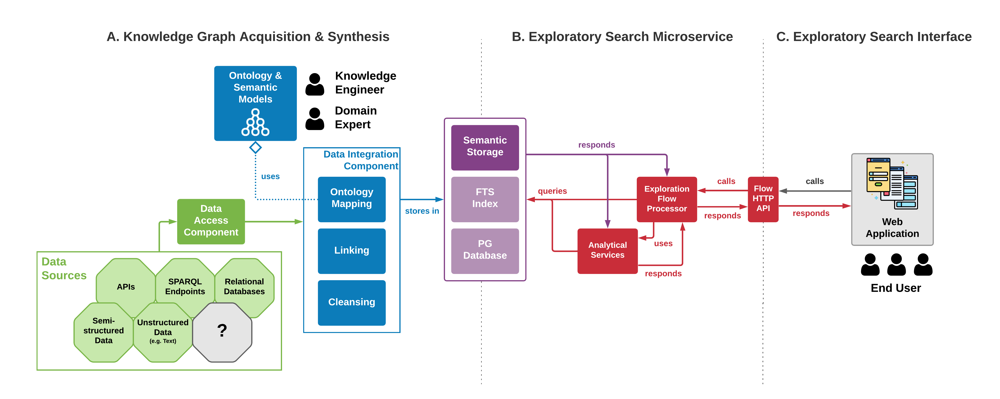
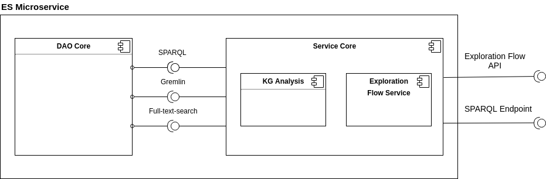

# Exploratory Search Microservice

The platform for enabling exploratory search can be roughly divided into three 
parts as depicted in the figure below. The ES system covers the two right-most
parts, while the knowledge graph acquisition and synthesis (i.e. the left-most
part) is highly dependent on the use case as well as the environment it shall be
applied to. Hence, the ES system only expects the resulting knowledge graph to
be available in a storage solution that is able to provide the expected
interfaces.



The exploratory search microservice is sitting on top of a knowledge graph and
provides services to the web application enabling exploratory search on
mentioned knowledge graph. This microservice expects three interfaces to the
knowledge graph, namely SPARQL, Gremlin and a full-text search index. Itself
offers a REST interface to the web application, allowing clients to execute
exploration flows.

## Architecture

As depicted in the figure below, this ES mciroservice consists of two major 
components, 1) DAO core and 2) service core.



### 1) DAO Core
The DAO core aims to abstract the storage solutions and tries to achieve this
goal by introducing three interfaces. The SPARQL interface defines two methods,
one making it possible to issue a `SELECT`, `ASK`, `DESCRIBE` as well as
`CONSTRUCT` query, and one method allowing to issue update queries. Both of
these methods must behave as expected from a standard SPARQL endpoint. Among
most of the popular triplestores, a full-text-search index for fast keyword
searches can only be accessed with proprietary additions to SPARQL (differing
from vendor to vendor), which is why a full-text search interface was
additionally introduced. This interface has a single method for issuing a search
given a keyword phrase. This single method is expected to return the results of
the search in form of a list of resources (their IRI) and optionally a score
assigned to them. The third expected interface is offering a Gremlin traversal
over the knowledge graph.

### 2) Service Core
The service core has two main tasks, a) handling of the knowledge graph analysis
and b) the execution of requests to the exploration flow API.

#### a) Analytic services
Analytic services analyze a certain aspect of the (semantic) structure of a
knowledge graph. They can make use of the three provided interfaces by the DAO
core, or rely on the results of other analytic services. All of these services
are maintained in a registry. They are expected to have one method named
`compute()` and must be annotated with `RegisterForAnalyticalProcessing`. The
annotation specifies the unique name of this analytic service, and other
services it relies on. Given the Resnik similarity for example, the class
hierarchy as well as the information content values for classes must be computed
before this metric can yield a result and thus, these two services must be
specified as dependencies in the annotation of this analytic service. An
analysis processor is then able to automatically construct a suiting pipeline of
all registered analytic services. The execution of such a pipeline can be
invoked at start-ups and/or at updates to the knowledge graph. The result of the
analysis can then be accessed over the exploration flow API.

#### b) Exploration flows
Exploration flows are a sequence of operations with a well-defined purpose. An
operation in a flow can make directly use of the three provided interfaces by
the DAO core, or access the results of certain analytic services. Exploration
flows are expressed in JSON format and each operation is uniquely identified by
a name, expects a certain input type and optionally arguments. The service core
provides a compiler for exploration flows, which searches for the corresponding
operator in a registry, constructs the flow of operators with their
corresponding arguments and then executes them. The registry is assembled
automatically at the start-up by searching throw the classes of the application.
Operators that can be used in an exploration flow request must be annotated with
`RegisterForExplorationFlow`. Exploration flows are discussed in more detail in
the next section.

## Build

The microservice is a Spring Boot application implemented in Java.

Requirements:
* Java JDK (>= 1.8)
* Maven

The application can be build with the following command. Its suggested to skip
the tests, because it takes a while to compute the tests.

```bash
$ mvn package -DskipTests=true
```

The build results in a JAR package named `esm.jar`, which can be executed.

### Docker Image

This repository also provides a Dockerfile for building a container image for
this microservice. The build requires a running Docker daemon.

```bash
$ docker build . -t yyyy/esm:latest
```

## Run

The execution is as simple as the following line. However, in order to use the
service a correct configuration has to be passed, which is described in the
subsequent section.

```bash
$ java -jar esm.jar
```

You can see the Swagger documentation of the REST API by visiting the endpoint
with a browser, per default `http://localhost:8080`.

### Configuration

#### Logging

The general logging level can be set as following. Per default the logging level
is `INFO`.

```
logging.level.at.ac.tuwien=INFO
```

Advanced logging of the execution of exploration flows is disabled per default
and can be enabled  with the following line. The start as well as end of each
step will then be logged.

```
esm.flow.execution.logging=true
```

Moreover, a stopwatch for the execution of steps of an exploration flow can be
enabled. The result of the stopwatch is then added to the meta section of the
JSON response for an exploration flow.

```
esm.flow.stopwatch=true
```

However, it is also possible to log the stopwatch results by setting following
line.

```
esm.flow.stopwatch.logging=true
```

#### Backend Storage Solution

The RDF data is most commonly stored in a triplestore. In the sections below, a
number of supported popular stores are listed. It is required to select the
storage solution with the following property:

```
esm.db.choice=GraphDB
```

Possible choices are `GraphDB`, `Stardog`, `Blazegraph` and `Virtuoso`.

##### GraphDB

Ontotext [GraphDB](http://graphdb.ontotext.com/documentation/standard/) is a 
commercial triplestore with in-built reasoning engines. Ontotext provides a free
community edition of the database with the limitation that only two SPARQL 
queries can be computed in parallel.

| Parameter | Description | Required? |
|---|----|---|
| graphdb.repository.id | The ID of the repository | Yes |
| graphdb.address | The host address of the GraphDB server | Yes |
| graphdb.username | Username of account having access to the GraphDB server | No |
| graphdb.password | Password of the account with specified username | No |

##### Stardog

[Stardog](https://www.stardog.com/) is a commercial triplestore with in-built
reasoning engines and some other features. Stardog offers a free license of this
product with some limitations such as limit to the total number of triples.

| Parameter | Description | Required? |
|----|---|----|
| stardog.db.name | The ID of the database/repository in Stardog | Yes |
| stardog.address | The host address of the Stardog server | Yes |
| stardog.username | Username of account having access to the Stardog server | No |
| stardog.password | Password of the account with specified username | No |

##### Blazegraph

[Blazegraph](https://blazegraph.com/) is an open-source triplestore, which had
a stale development for some years, but seems to be developed on again.

| Parameter | Description | Required? |
|----|---|----|
| blazegraph.address | The address of the SPARQL endpoint | Yes |

##### Virtuoso

OpenLink [Virtuoso](https://virtuoso.openlinksw.com/) is a commercial
triplestore that is used among others by DBPedia. OpenLink as well provides a
free community edition of its triplestore ([here](http://vos.openlinksw.com/owiki/wiki/VOS)).

| Parameter | Description | Required? |
|----|---|----|
| virtuoso.address | The address of the SPARQL endpoint | Yes |

# Contact

* Kevin Haller - [contact@kevinhaller.dev](mailto:contact@kevinhaller.dev) or [kevin.haller@tuwien.ac.at](mailto:kevin.haller@tuwien.ac.at)